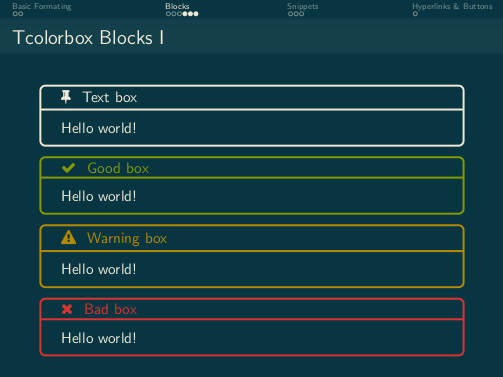
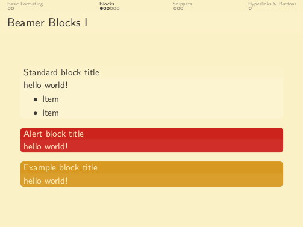

q<h1 align="center">
Dark Beamer
</h1>

# Features
- Color schemes:
    - 🧛 Dracula
    - 🌞 Solarized (Dark/Light)
    - 🥫 Gruvbox (Dark/Light)
    - 🌲 Everforest (Dark/Light)

- Integration with default beamer templates

# Examples

<table>
    <tr>
        <th >Color Scheme</th>
        <th>Title Page</th>
        <th>Lists</th>
        <th>Beamer blocks</th>
        <th>Color blocks</th>
        <th>Snippets</th>
    </tr>
    <tr>
        <td>
        <a href="https://draculatheme.com/">Dracula</a>
        </td>
        <td></td>
        <td></td>
        <td></td>
        <td></td>
        <td></td>
    </tr>
    <tr>
        <td>
        <a href="https://en.wikipedia.org/wiki/Solarized">Solarized Dark</a>
        </td>
        <td></td>
        <td></td>
        <td></td>
        <td></td>
        <td></td>
    </tr>
    <tr>
        <td>
        <a href="https://en.wikipedia.org/wiki/Solarized">Solarized Light</a>
        </td>
        <td></td>
        <td></td>
        <td></td>
        <td></td>
        <td></td>
    </tr>
    <tr>
        <td>
        <a href="https://github.com/morhetz/gruvbox">Gruvbox Dark</a>
        </td>
        <td></td>
        <td></td>
        <td></td>
        <td></td>
        <td></td>
    </tr>
    <tr>
        <td>
        <a href="https://github.com/morhetz/gruvbox">Gruvbox Light</a>
        </td>
        <td></td>
        <td></td>
        <td></td>
        <td></td>
        <td></td>
    </tr>
    <tr>
        <td>
        <a href="https://github.com/sainnhe/everforest">Everforest Dark</a>
        </td>
        <td></td>
        <td></td>
        <td></td>
        <td></td>
        <td></td>
    </tr>
    <tr>
        <td>
        <a href="https://github.com/sainnhe/everforest">Everforest Light</a>
        </td>
        <td></td>
        <td></td>
        <td></td>
        <td></td>
        <td></td>
    </tr>
</table>
